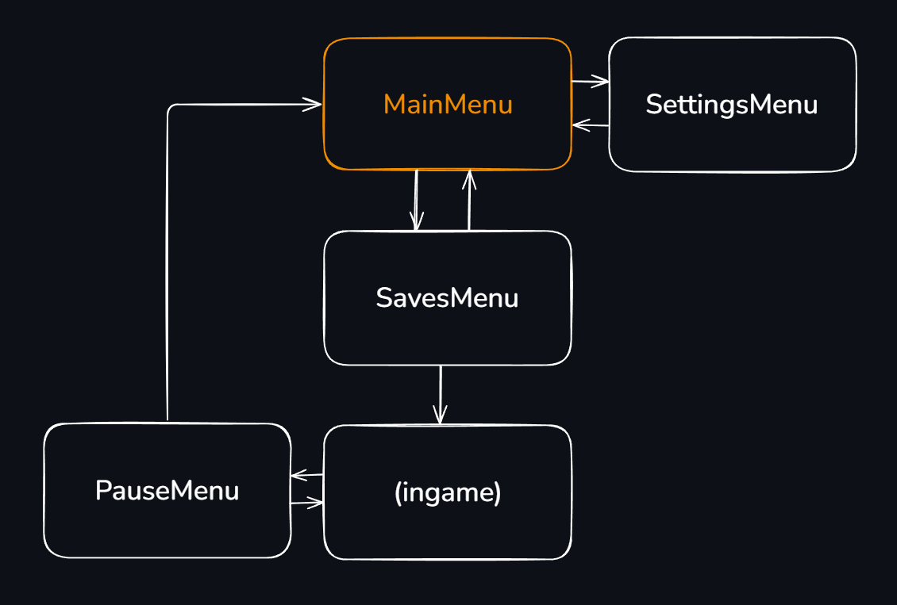

# split-souls

## Table of Contents
- [Excalidraw](#excalidraw)
- [How to build](#how-to-build)
- [Navigation](#navigation)

## Excalidraw

* Open the file `docs/split-souls.excalidraw` in [Excalidraw](https://excalidraw.com/)
* Make changes (the things you added to the game)
* Save the file to the same path
* optional: take screenshots and add it in this `README.md`

## How to build

* Go to "actions" tab in GitHub Repo
* Choose debug or release build in the left panel
* Click "Run workflow" on the right and choose platform
* Wait for the build to finish.

## Navigation

